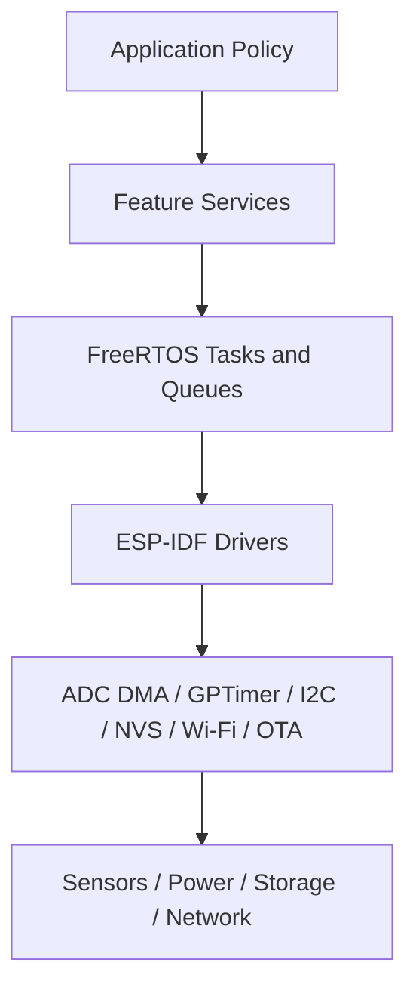

# ESP32 Platform Architecture

```mermaid
flowchart TD
  App[Application Policy] --> Services[Feature Services]
  Services --> RTOS[FreeRTOS Tasks and Queues]
  RTOS --> Drivers[ESP-IDF Drivers]
  Drivers --> Peripherals[ADC DMA / GPTimer / I2C / NVS / Wi-Fi / OTA]
  Peripherals --> Hardware[Sensors / Power / Storage / Network]
```
