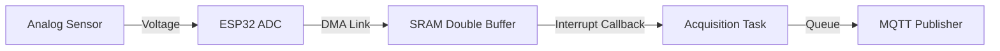

# ESP32 Validation Subsystems Data Flows

## DMA Continuous ADC Pipeline

```mermaid
graph LR
  Sensor[Analog Sensor] -->|Voltage| ADC[ESP32 ADC]
  ADC -->|DMA Link| Buffer[SRAM Double Buffer]
  Buffer -->|Interrupt Callback| Task[Acquisition Task]
  Task -->|Queue| MQTT[MQTT Publisher]
```
