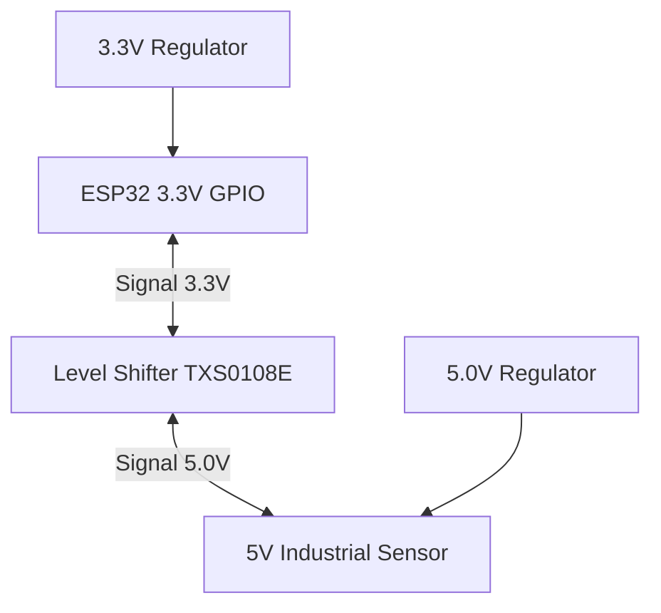

# ESP32 Peripheral Interaction & Wiring Diagrams

## Logic Level Shift Interfacing

```mermaid
graph TD
  ESP[ESP32 3.3V GPIO] <-->|Signal 3.3V| LLS[Level Shifter TXS0108E]
  LLS <-->|Signal 5.0V| Peripheral[5V Industrial Sensor]
  Power1[3.3V Regulator] --> ESP
  Power2[5.0V Regulator] --> Peripheral
```
