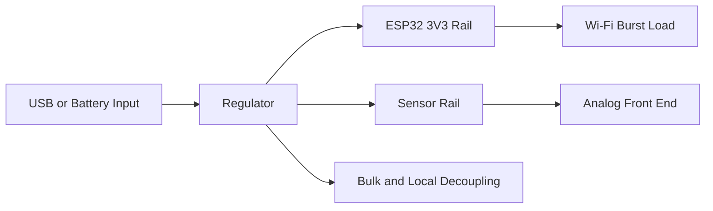

# Power Architecture

```mermaid
flowchart LR
  USB[USB or Battery Input] --> Reg[Regulator]
  Reg --> ESP32[ESP32 3V3 Rail]
  Reg --> Sensors[Sensor Rail]
  ESP32 --> WiFi[Wi-Fi Burst Load]
  Sensors --> Analog[Analog Front End]
  Reg --> Decoupling[Bulk and Local Decoupling]
```
