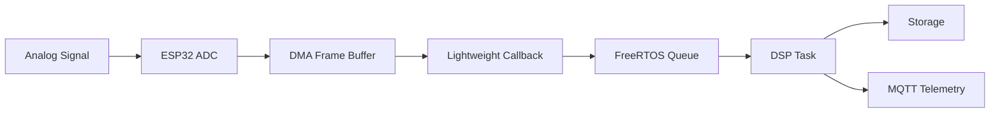

# ADC DMA Pipeline

```mermaid
flowchart LR
  Signal[Analog Signal] --> ADC[ESP32 ADC]
  ADC --> DMA[DMA Frame Buffer]
  DMA --> ISR[Lightweight Callback]
  ISR --> Queue[FreeRTOS Queue]
  Queue --> DSP[DSP Task]
  DSP --> Storage[Storage]
  DSP --> MQTT[MQTT Telemetry]
```
