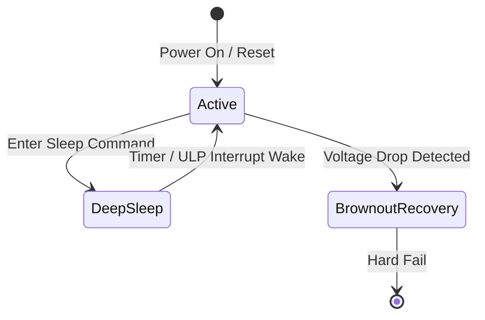

# ESP32 Validation Subsystems State Machines

## Low-Power Sleep State Machine

```mermaid
stateDiagram-v2
  [*] --> Active : Power On / Reset
  Active --> DeepSleep : Enter Sleep Command
  DeepSleep --> Active : Timer / ULP Interrupt Wake
  Active --> BrownoutRecovery : Voltage Drop Detected
  BrownoutRecovery --> [*] : Hard Fail
```
