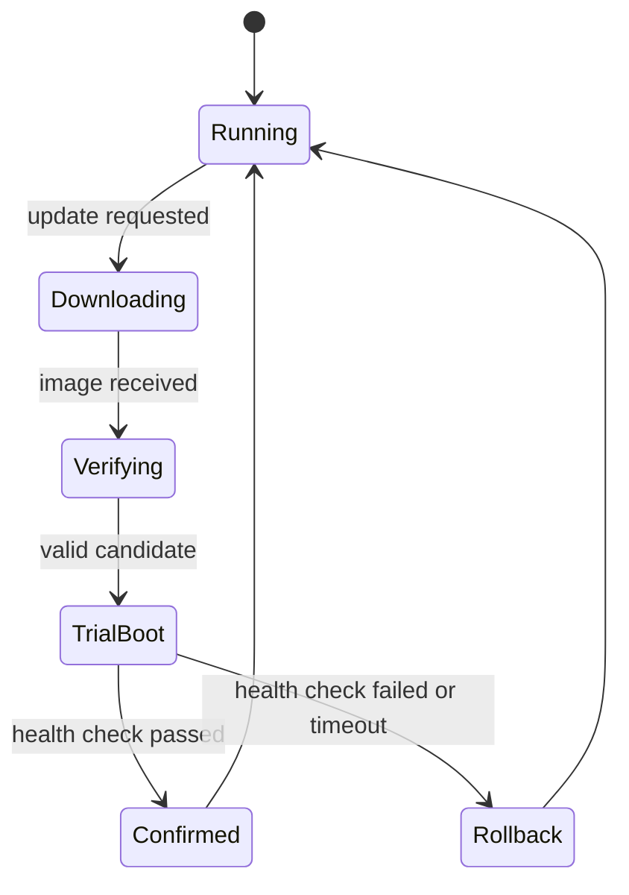

# OTA Lifecycle State Machine

```mermaid
stateDiagram-v2
  [*] --> Running
  Running --> Downloading: update requested
  Downloading --> Verifying: image received
  Verifying --> TrialBoot: valid candidate
  TrialBoot --> Confirmed: health check passed
  TrialBoot --> Rollback: health check failed or timeout
  Rollback --> Running
  Confirmed --> Running
```
