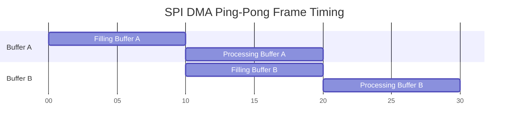

# ESP32 Validation Subsystems Timing Diagram

## SPI DMA Ping-Pong Buffer Transitions

```mermaid
gantt
  title SPI DMA Ping-Pong Frame Timing
  dateFormat ss
  axisFormat %S
  section Buffer A
  Filling Buffer A       :a1, 00, 10s
  Processing Buffer A    :after a1, 10s
  section Buffer B
  Filling Buffer B       :b1, 10, 10s
  Processing Buffer B    :after b1, 10s
```
