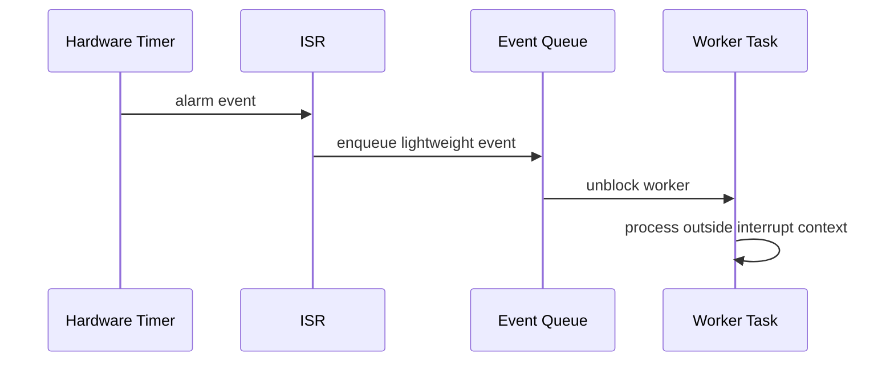

# Interrupt-to-Worker Timing

```mermaid
sequenceDiagram
  participant Timer as Hardware Timer
  participant ISR as ISR
  participant Queue as Event Queue
  participant Task as Worker Task
  Timer->>ISR: alarm event
  ISR->>Queue: enqueue lightweight event
  Queue->>Task: unblock worker
  Task->>Task: process outside interrupt context
```
