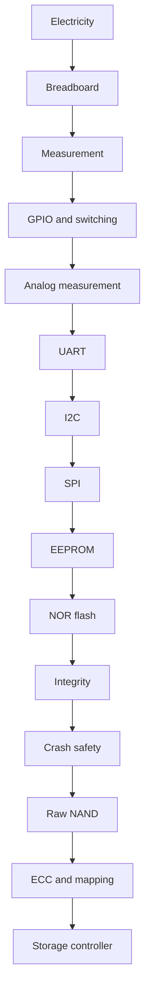

# Curriculum Dependency Graph

No NAND, PCIe or controller RTL entry path bypasses power, measurement, synchronous buses,
integrity and recovery. The first ten projects stop at crash-safe NOR; the existing SSD lab
continues through NAND, ECC, FTL and controller behaviour.
