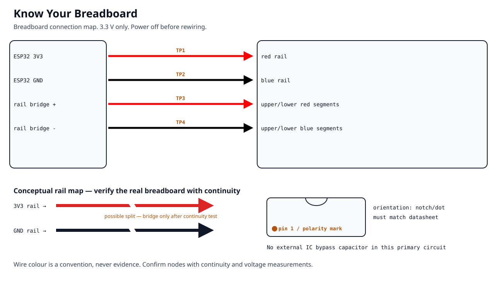
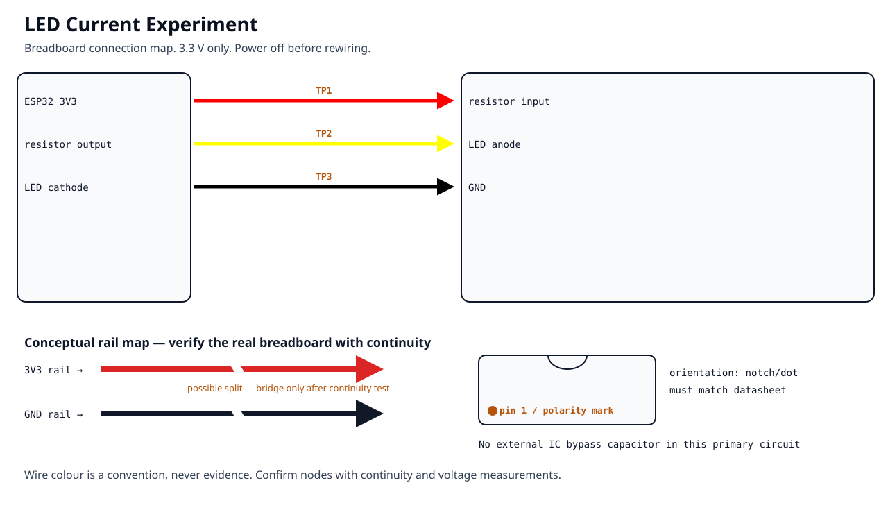
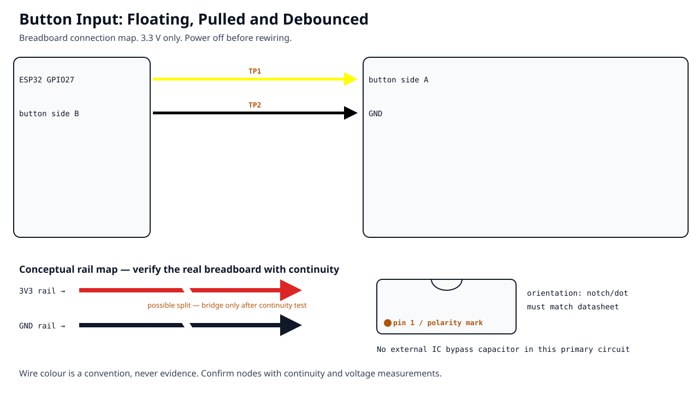
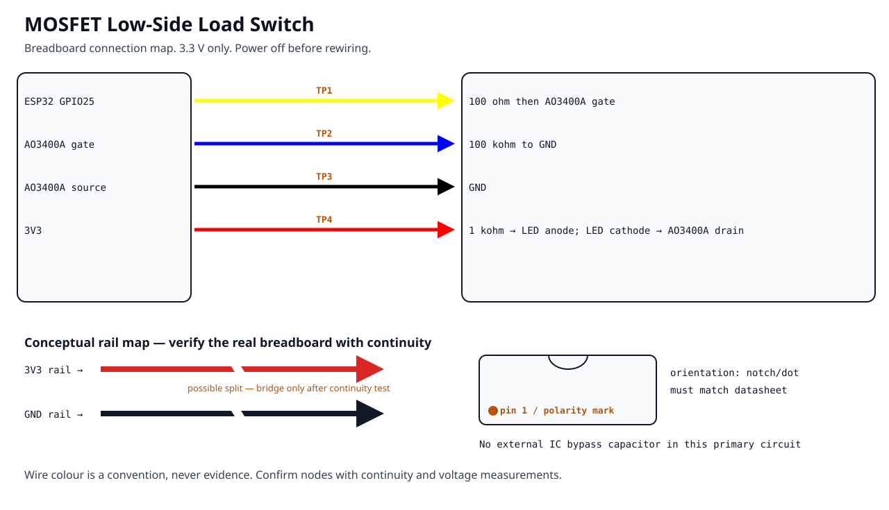
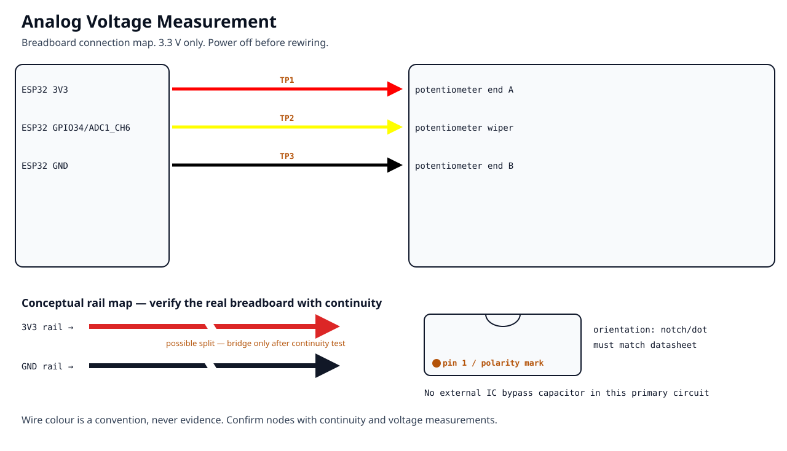
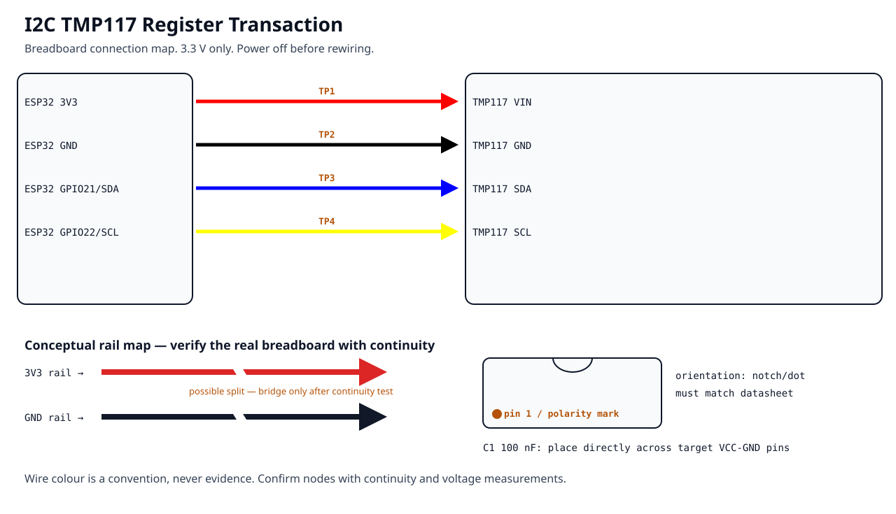
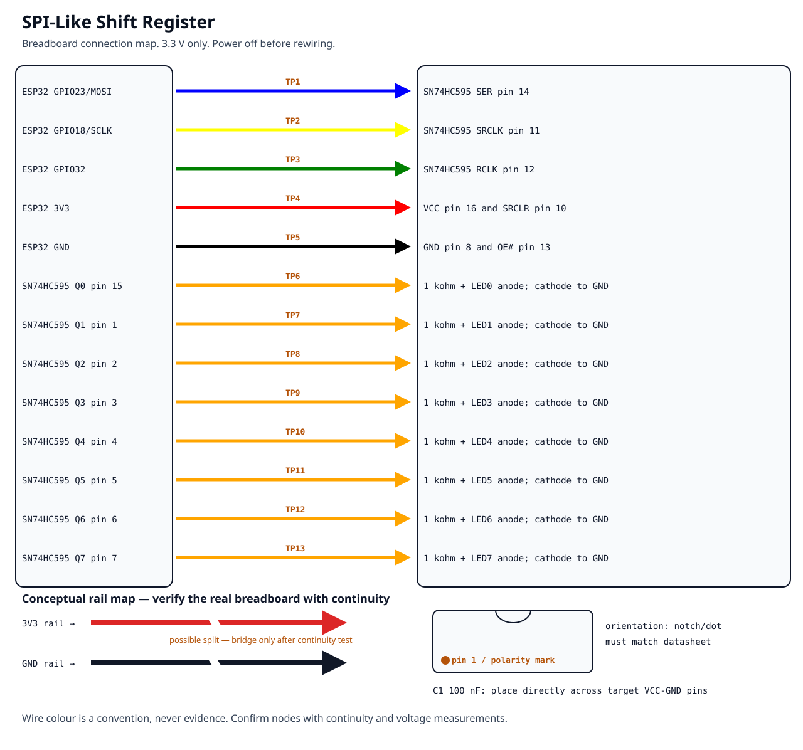
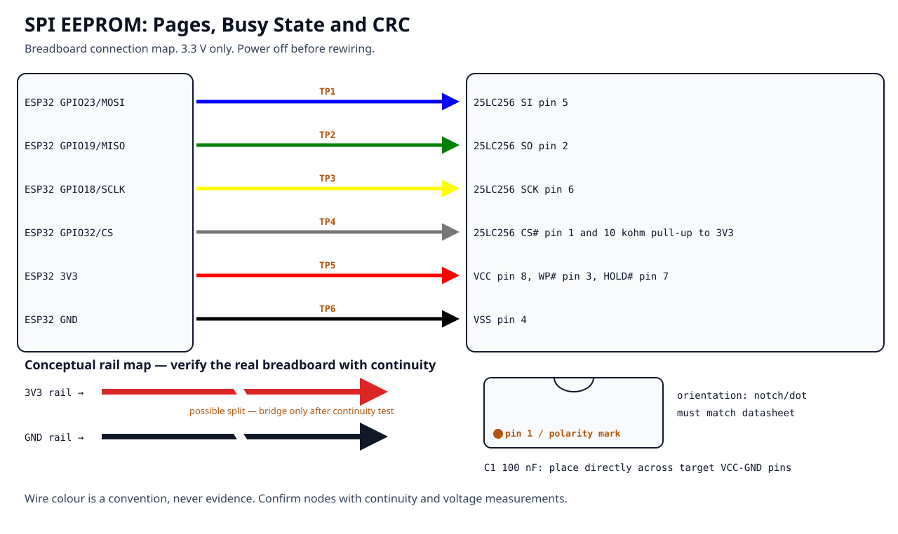
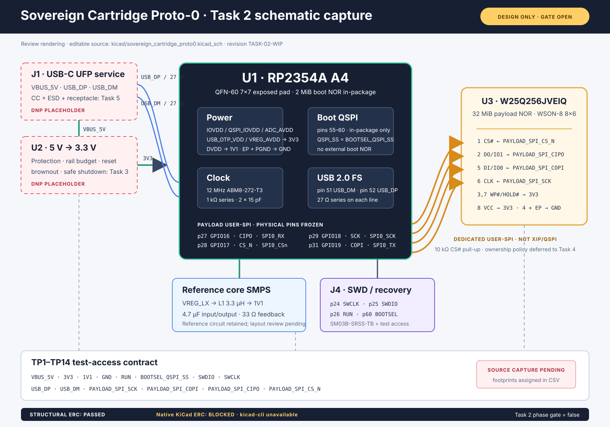

<!-- Generated by tools/generate_project_discovery.py; do not edit by hand. -->
# Visual Project Catalog

Choose a numbered project, inspect its build image, then open the code or
full validation path. The visual layer is an entry point; BOM, safety,
measurement and evidence contracts remain authoritative.

## Sequence

Breadboard fundamentals → digital buses → storage integrity → controller work.

## Quick index

01. [Know Your Breadboard](breadboard/01-know-your-breadboard/README.md)
02. [LED Current Experiment](breadboard/02-led-current/README.md)
03. [Button Input: Floating, Pulled and Debounced](breadboard/03-button-input/README.md)
04. [MOSFET Low-Side Load Switch](breadboard/04-mosfet-load-switch/README.md)
05. [Analog Voltage Measurement](breadboard/05-analog-voltage/README.md)
06. [UART Framed Conversation](buses/06-uart-conversation/README.md)
07. [I2C TMP117 Register Transaction](buses/07-i2c-sensor/README.md)
08. [SPI-Like Shift Register](buses/08-spi-shift-register/README.md)
09. [SPI EEPROM: Pages, Busy State and CRC](storage/09-spi-eeprom/README.md)
10. [SPI NOR Mini-Storage](storage/10-spi-nor-mini-storage/README.md)

## Breadboard

### 01 — Know Your Breadboard

**Beginner · 60 minutes · ESP32-DEVKITC-32E · 3.3 V · Physical measurement**

[Start project](breadboard/01-know-your-breadboard/README.md) · [Open code](breadboard/01-know-your-breadboard/CODE/) · [Breadboard map](../assets/projects/01-know-your-breadboard/breadboard.svg) · [Electrical schematic](../assets/projects/01-know-your-breadboard/schematic.svg)

Evidence status: **Hardware evidence required**.

---

### 02 — LED Current Experiment

**Beginner · 75 minutes · ESP32-DEVKITC-32E · 3.3 V · DC**

[Start project](breadboard/02-led-current/README.md) · [Open code](breadboard/02-led-current/CODE/) · [Breadboard map](../assets/projects/02-led-current/breadboard.svg) · [Electrical schematic](../assets/projects/02-led-current/schematic.svg)

Evidence status: **Hardware evidence required**.

---

### 03 — Button Input: Floating, Pulled and Debounced

**Beginner · 90 minutes · ESP32-DEVKITC-32E · 3.3 V · GPIO**

[Start project](breadboard/03-button-input/README.md) · [Open code](breadboard/03-button-input/CODE/) · [Breadboard map](../assets/projects/03-button-input/breadboard.svg) · [Electrical schematic](../assets/projects/03-button-input/schematic.svg)

Evidence status: **Hardware evidence required**.

---

### 04 — MOSFET Low-Side Load Switch

**Beginner · 100 minutes · ESP32-DEVKITC-32E · 3.3 V · GPIO**

[Start project](breadboard/04-mosfet-load-switch/README.md) · [Open code](breadboard/04-mosfet-load-switch/CODE/) · [Breadboard map](../assets/projects/04-mosfet-load-switch/breadboard.svg) · [Electrical schematic](../assets/projects/04-mosfet-load-switch/schematic.svg)

Evidence status: **Hardware evidence required**.

---

### 05 — Analog Voltage Measurement

**Beginner · 110 minutes · ESP32-DEVKITC-32E · 3.3 V · ADC**

[Start project](breadboard/05-analog-voltage/README.md) · [Open code](breadboard/05-analog-voltage/CODE/) · [Breadboard map](../assets/projects/05-analog-voltage/breadboard.svg) · [Electrical schematic](../assets/projects/05-analog-voltage/schematic.svg)

Evidence status: **Hardware evidence required**.

---

## Digital buses

### 06 — UART Framed Conversation

**Intermediate · 120 minutes · ESP32-DEVKITC-32E · 3.3 V · UART**

[Start project](buses/06-uart-conversation/README.md) · [Open code](buses/06-uart-conversation/CODE/) · [Breadboard map](../assets/projects/06-uart-conversation/breadboard.svg) · [Electrical schematic](../assets/projects/06-uart-conversation/schematic.svg)

Evidence status: **Hardware evidence required**.

---

### 07 — I2C TMP117 Register Transaction

**Intermediate · 130 minutes · ESP32-DEVKITC-32E · 3.3 V · I2C**

[Start project](buses/07-i2c-sensor/README.md) · [Open code](buses/07-i2c-sensor/CODE/) · [Breadboard map](../assets/projects/07-i2c-sensor/breadboard.svg) · [Electrical schematic](../assets/projects/07-i2c-sensor/schematic.svg)

Evidence status: **Hardware evidence required**.

---

### 08 — SPI-Like Shift Register

**Intermediate · 140 minutes · ESP32-DEVKITC-32E · 3.3 V · SPI-like synchronous serial**

[Start project](buses/08-spi-shift-register/README.md) · [Open code](buses/08-spi-shift-register/CODE/) · [Breadboard map](../assets/projects/08-spi-shift-register/breadboard.svg) · [Electrical schematic](../assets/projects/08-spi-shift-register/schematic.svg)

Evidence status: **Hardware evidence required**.

---

## Storage

### 09 — SPI EEPROM: Pages, Busy State and CRC

**Intermediate · 180 minutes · ESP32-DEVKITC-32E · 3.3 V · SPI**

[Start project](storage/09-spi-eeprom/README.md) · [Open code](storage/09-spi-eeprom/CODE/) · [Breadboard map](../assets/projects/09-spi-eeprom/breadboard.svg) · [Electrical schematic](../assets/projects/09-spi-eeprom/schematic.svg)

Evidence status: **Hardware evidence required**.

---

### 10 — SPI NOR Mini-Storage

**Advanced Beginner · 240 minutes · ESP32-DEVKITC-32E · 3.3 V · SPI, JEDEC NOR**

[Start project](storage/10-spi-nor-mini-storage/README.md) · [Open code](storage/10-spi-nor-mini-storage/CODE/) · [Breadboard map](../assets/projects/10-spi-nor-mini-storage/breadboard.svg) · [Electrical schematic](../assets/projects/10-spi-nor-mini-storage/schematic.svg)

Evidence status: **Hardware evidence required**.

---

## Advanced project

### Sovereign Cartridge Proto-0

RP2354A A4 with separate boot and payload NOR, explicit recovery access,
and evidence-gated hardware development.

[Open platform](../hardware/platforms/sovereign_cartridge_proto0/README.md) · [Open schematic status](../hardware/platforms/sovereign_cartridge_proto0/schematics/README.md)

Evidence status: **Design only; hardware authorization remains disabled**.

## Engineering paths

1. [`breadboard/`](breadboard/README.md) — continuity, current, GPIO, switching and ADC.
2. [`buses/`](buses/README.md) — framed UART, register-level I²C and visible SPI.
3. [`storage/`](storage/README.md) — SPI EEPROM and crash-safe SPI NOR.
4. [`ssd_lab/`](ssd_lab/README.md) — raw NAND, FTL, ECC, mapping and controller validation.

New contributors should start from [`templates/physical-project/`](../templates/physical-project/).
