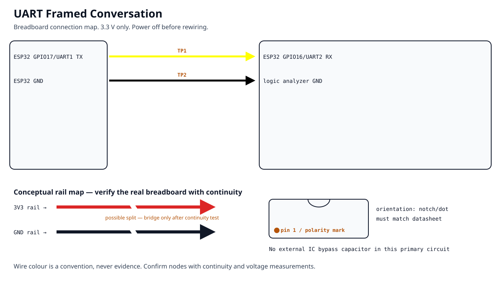
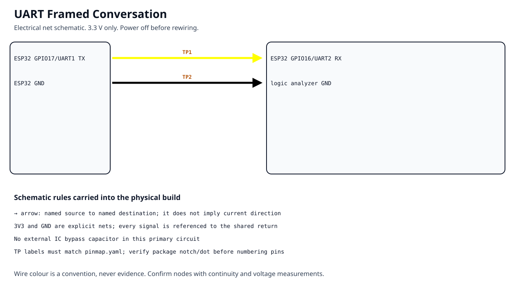

<!-- Generated by tools/generate_project_discovery.py; do not edit by hand. -->
# 06 — UART Framed Conversation

**Intermediate · 120 minutes · ESP32-DEVKITC-32E · 3.3 V**

[Start build](BUILD.md) · [Open code](CODE/) · [Wiring table](WIRING.md) · [Expected result](EXPECTED.md) · [Validation checklist](validation/checklist.md)

Interface: **UART**. Prerequisite: **05-analog-voltage**.

Evidence status: **Hardware evidence required**.

## Breadboard connection map

Use this image for physical orientation. Confirm every node against the
wiring table, pin map and continuity measurements before applying power.

## Electrical schematic

The schematic defines electrical connectivity. It is not evidence that the
physical build has been assembled or measured.

## Complete project record

- [Purpose and success condition](PROJECT.md)
- [Why the experiment matters](WHY.md)
- [Parts and sourcing](BUY.md)
- [Power-up safety gate](BEFORE-YOU-POWER.md)
- [Debugging path](DEBUG.md)
- [Measurement procedure](MEASURE.md)
- [Fault-injection exercise](BREAK-IT.md)
- [Evidence folder](evidence/README.md)
- [Next project](NEXT.md)
